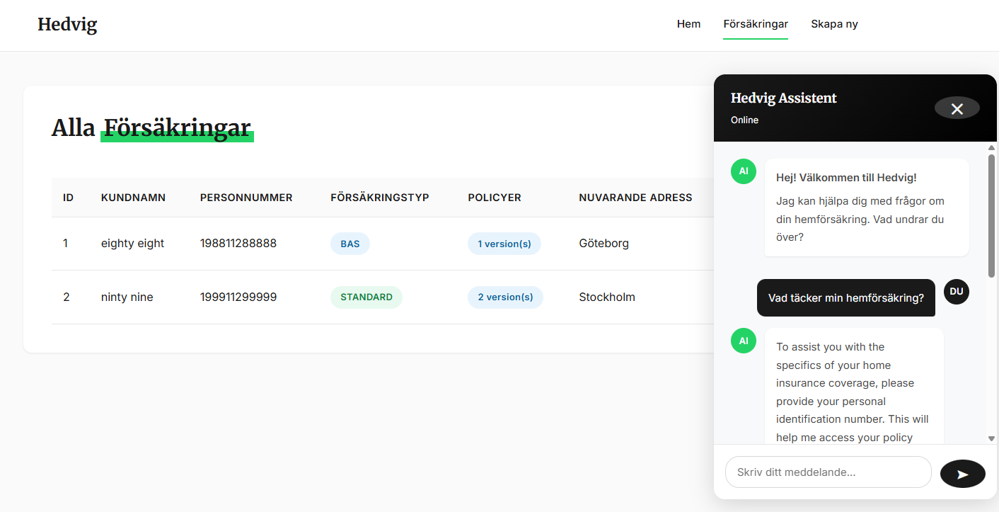
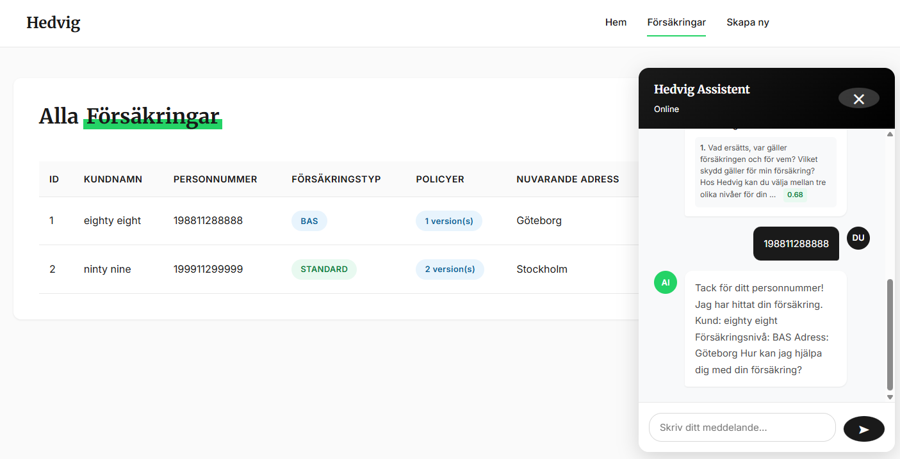
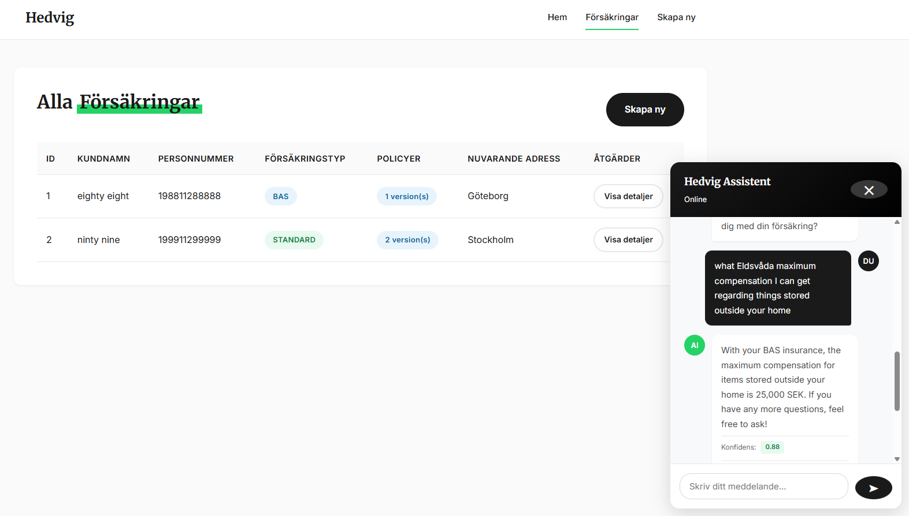
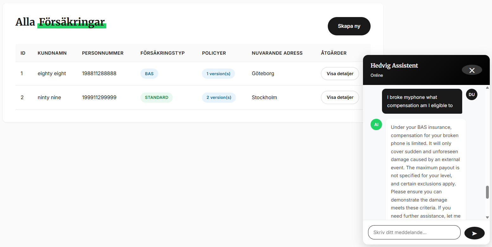

# Insurance Policy Chatbot - Run Guide

## Demo

<video src="videos/app.mp4" controls width="100%"></video>

## Hedvigs terms

To create a functional chatbot, I used HEDVIGs termd document
from their site: SE_APARTMENT_BRF-2025-10-01-HEDVIG-T&C.pdf 

This document is chunked into 47 topics as provided in the document
index.  These topics are then added with additional metadata like
all, standard+max and max levels to help the user in a better way.

## Chunking

These chunks are then converted into embeddings to enable semantic
search.  User is ased for personummer to identify themself.  then the
user-specific data is retrieved from database.

## Hybrid RAG

Hybrid search is implemented, where pre-filtering is done to check
which topic the user question is related to (fire, water leackage, etc),
then only the relavent chunk is sent to the next stage, where the
openai-chat-completions api is supposed to answer the users question 
(with the context provided fromt he hedvigs pdf document).

## Knows issues - to be improved in next iteration

In some cases the titile might not match with the users intent.  For
example if user asks a question about "my phone broke".  There is no
topic related to this in the terms pdf.  In this case we have to find 
the semantically close topic.  But the actual data is in the table
"Ersättningstabell för dina saker".  In order to fix this problem, we 
need to add more metadata for each chunks, which can be done later.

## Prerequisites

- Java 21+
- Maven (or use included `mvnw.cmd`)
- OpenAI API key (provided by uma)

## Environment Setup

Set your OpenAI API key:

# application.properties file, under project-root
openai.api.key="sk-..."

## Running the Application

```bash
./mvnw.cmd spring-boot:run
```

The app will start at: http://localhost:8080

### Hot Reload (Development)

With DevTools enabled, run in one terminal:
```bash
./mvnw.cmd spring-boot:run
```

In another terminal, recompile on changes:
```bash
./mvnw.cmd compile
```

## Running Tests``

### E2E RAG Pipeline Tests
```bash
./mvnw.cmd test -Dtest=RagPipelineE2ETest
```

## API Endpoints

| Endpoint | Method | Description |
|----------|--------|-------------|
| `/` | GET | Web UI |
| `/api/chat` | POST | Chat with the bot |
| `/api/chat/{id}` | DELETE | Clear conversation |
| `/api/policies` | GET | List all policies |
| `/h2-console` | GET | Database console |

## Screenshots

### 1. Ask ID to fetch user specific info


### 2. Fetch details from database


### 3. Eldsvåda question


### 4. Damaged Phone question


# Project Structure

```
insurance-policy-chatbot/
├── src/main/kotlin/com/hedvig/policies/
│   ├── PoliciesApplication.kt      # Spring Boot entry point
│   ├── controller/
│   │   ├── ChatController.kt       # REST API for chat
│   │   ├── PolicyController.kt     # REST API for policies
│   │   └── WebController.kt        # Serves HTML pages
│   ├── service/
│   │   ├── ChatService.kt          # Main chat orchestration
│   │   ├── OpenAIService.kt        # OpenAI API client
│   │   ├── VectorSearchService.kt  # RAG vector search
│   │   ├── JsonStorageService.kt   # Embeddings storage
│   │   ├── PolicyService.kt        # Policy CRUD operations
│   │   └── PdfParsingService.kt    # PDF text extraction
│   ├── domain/
│   │   ├── Insurance.kt            # Insurance entity (JPA)
│   │   └── Policy.kt               # Policy entity (JPA)
│   ├── dto/
│   │   ├── ChatDto.kt              # Chat request/response
│   │   ├── OpenAIDto.kt            # OpenAI API models
│   │   └── PolicyChunkDto.kt       # Vector chunk models
│   └── util/
│       └── PersonnummerExtractor.kt # Swedish ID extraction
├── src/main/resources/
│   ├── application.properties      # App configuration
│   ├── templates/                  # Thymeleaf HTML templates
│   └── db/changelog/               # Liquibase migrations
├── data/
│   └── policy-chunks-embeddings.json  # Pre-computed embeddings
├── docs/terms/
│   └── hedvig-brf-standard.pdf     # Insurance terms PDF
└── src/test/kotlin/
    └── RagPipelineE2ETest.kt       # End-to-end tests
```

## Data Flow

```
┌─────────────────────────────────────────────────────────────────┐
│                        RAG PIPELINE                             │
├─────────────────────────────────────────────────────────────────┤
│                                                                 │
│  1. DOCUMENT INGESTION (one-time)                              │
│     ┌─────────┐    ┌──────────────┐    ┌──────────────────┐   │
│     │ PDF     │───▶│ PdfParsing   │───▶│ OpenAI Embedding │   │
│     │ Terms   │    │ Service      │    │ API              │   │
│     └─────────┘    └──────────────┘    └────────┬─────────┘   │
│                                                  │              │
│                                                  ▼              │
│                                        ┌──────────────────┐    │
│                                        │ JSON File        │    │
│                                        │ (embeddings)     │    │
│                                        └──────────────────┘    │
│                                                                 │
│  2. QUERY PROCESSING (each request)                            │
│     ┌─────────┐    ┌──────────────┐    ┌──────────────────┐   │
│     │ User    │───▶│ ChatService  │───▶│ VectorSearch     │   │
│     │ Query   │    │              │    │ Service          │   │
│     └─────────┘    └──────────────┘    └────────┬─────────┘   │
│                                                  │              │
│         ┌────────────────────────────────────────┘              │
│         │                                                       │
│         ▼                                                       │
│     ┌──────────────────┐                                       │
│     │ a) Topic Mapping │  (GPT-4o-mini maps query to topics)   │
│     └────────┬─────────┘                                       │
│              │                                                  │
│              ▼                                                  │
│     ┌──────────────────┐                                       │
│     │ b) Filter Chunks │  (by topic + user's plan level)       │
│     └────────┬─────────┘                                       │
│              │                                                  │
│              ▼                                                  │
│     ┌──────────────────┐                                       │
│     │ c) Semantic Rank │  (cosine similarity on embeddings)    │
│     └────────┬─────────┘                                       │
│              │                                                  │
│              ▼                                                  │
│     ┌──────────────────┐    ┌──────────────────┐              │
│     │ d) Context +     │───▶│ GPT-4o-mini      │              │
│     │    Query         │    │ Generate Answer  │              │
│     └──────────────────┘    └────────┬─────────┘              │
│                                       │                        │
│                                       ▼                        │
│                              ┌──────────────────┐              │
│                              │ Response +       │              │
│                              │ Confidence Score │              │
│                              └──────────────────┘              │
└─────────────────────────────────────────────────────────────────┘
```

## Key Components

### 1. Insurance Terms PDF
**Location:** `docs/terms/hedvig-brf-standard.pdf`

The source document containing insurance policy terms in Swedish. This PDF is parsed and chunked into searchable segments.

### 2. Embeddings JSON File
**Location:** `data/policy-chunks-embeddings.json`

Pre-computed vector embeddings for each text chunk. Structure:
```json
{
  "chunks": [
    {
      "documentName": "hedvig-brf-standard",
      "chunkIndex": 0,
      "content": "Eldsvåda - Max: 3 000 000 kr...",
      "embedding": [0.123, -0.456, ...],
      "metadata": {
        "topic": "Eldsvåda",
        "plan": "Max",
        "documentSection": "Ersättningstabell"
      }
    }
  ]
}
```

### 3. H2 Database
**Location:** `./db-file.mv.db` (auto-created)

Stores customer and policy data:
- `insurance` table: Customer info + plan type (Bas/Standard/Max)
- `policy` table: Policy versions with addresses and dates

Access console: http://localhost:8080/h2-console
- JDBC URL: `jdbc:h2:file:./db-file`
- Username: `sa`
- Password: (empty)

### 4. Chat Flow

1. **User sends message** → `ChatController`
2. **Extract personnummer** (if provided) → `PersonnummerExtractor`
3. **Lookup user's insurance** → `PolicyService` → H2 Database
4. **Hybrid vector search** → `VectorSearchService`
   - AI maps query to relevant topics
   - Filter chunks by user's plan level
   - Rank by semantic similarity
5. **Generate response** → `OpenAIService` (GPT-4o-mini)
6. **Return with confidence score** from logprobs

### 5. Confidence Score

Calculated from OpenAI's token log probabilities:
- `logprobs` returned for each token
- Average probability = `exp(avg(logprobs))`
- Displayed as percentage (0.0-1.0)

| Score | Meaning |
|-------|---------|
| 0.8+ | High confidence (green) |
| 0.5 - 7.9 | Medium confidence (yellow) |
| <0.5 | Low confidence (red) |
